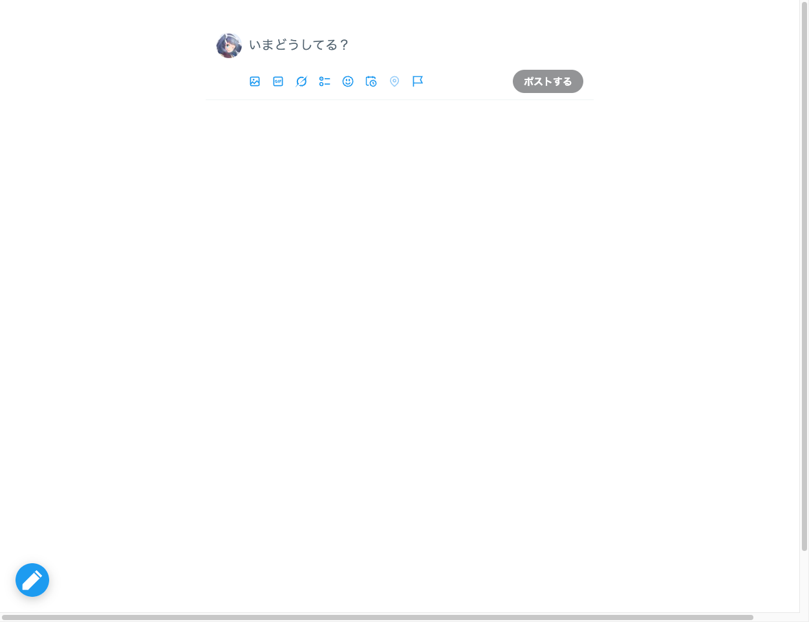

# tampermonkey-x-post-mode

A Tampermonkey userscript that simplifies the X (Twitter) UI into a **post-only view**, hiding everything except the compose area.

Toggle between Post Mode and the original page with a fixed button in the bottom-left corner.

## Features

- **`/home`** — Hides the left sidebar, right sidebar, and timeline feed. Only the compose area remains, centered and framed
- **`/{profile}`** — Hides the left sidebar, right sidebar, tab navigation, and tweet list. Injects a **Post** button into the center column
- **Toggle button** — Fixed at the bottom-left. Blue pen icon = Post Mode, gray list icon = Full view
- **Persistent state** — Mode is saved across sessions via `GM_setValue`
- **SPA-aware** — Reacts to X's client-side navigation via `MutationObserver`

## Screenshots

| Post Mode (`/home`) | Post Mode (`/{profile}`) |
|---|---|
|  |  |

Smartphone view (Post Mode on `/{profile}`):

## Installation

1. Install [Tampermonkey](https://www.tampermonkey.net/) in your browser
2. Click [this link](https://github.com/aiya000/tampermonkey-x-twitter-post-mode/raw/refs/heads/main/x-post-mode.user.js),  
   or open [`x-post-mode.user.js`](./x-post-mode.user.js) and click **Raw**
3. Tampermonkey will prompt you to install the script — click **Install**

## Usage

| Action | Result |
|---|---|
| Visit `x.com/home` (or `twitter.com/home`) with Post Mode ON | Compose area only |
| Visit `x.com/{profile}` (or `twitter.com/{profile}`) with Post Mode ON | Profile info + Post button |
| Click the **blue pen button** (bottom-left) | Switch to full view |
| Click the **gray list button** (bottom-left) | Switch back to Post Mode |
